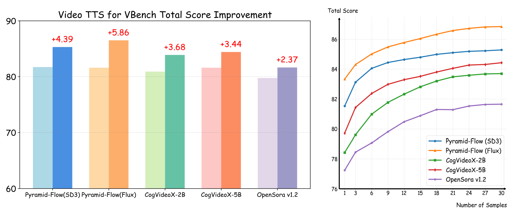

<div align="center">

# ✨ **Video-T1: Test-Time Scaling for Video Generation** ✨

<p align="center">
    <a href="https://liuff19.github.io/">Fangfu Liu</a><sup>1*</sup>,
    <a href="https://hanyang-21.github.io/">Hanyang Wang</a><sup>1*</sup>,
    <a href="https://github.com/JamesCai23">Yimo Cai</a><sup>1</sup>,
    <a href="https://iseesaw.github.io/">Kaiyan Zhang</a><sup>1</sup>,
    <a href="https://xiaohangzhan.github.io/">Xiaohang Zhan</a><sup></sup>,
    <a href="https://duanyueqi.github.io/">Yueqi Duan</a><sup>1</sup>,
    <br>
    <sup>*</sup>Equal Contribution.
    <br>
    <sup>1</sup>Tsinghua University
</p>

[](https://arxiv.org/abs/2503.18942) &nbsp;&nbsp;&nbsp;&nbsp;
[](https://liuff19.github.io/Video-T1/) &nbsp;&nbsp;&nbsp;&nbsp;
[](LICENSE) &nbsp;&nbsp;&nbsp;&nbsp;
[](https://mp.weixin.qq.com/s/HtJHXGgTAhi-uBWSsgqOKQ)
<br>


</div>

## 📢 **News**
- **2025.3.24**: 🎉 We proudly present *Video-T1: Test-Time Scaling for Video Generation*!

## 🎯 **Key Results**


Test-Time Scaling (TTS) demonstrates significant improvements in the quality and consistency of generated videos. As the search space expands with increased computation, model performance shows consistent enhancement.

## 🔄 **Pipeline Overview**


### TTS Video Generation Workflow:
- **Random Linear Search**: This approach samples Gaussian noise, generating a sequence of video clips through denoising. The highest-scoring output is selected based on test verifiers.
- **Tree of Frames (ToF) Search**: This multi-stage process includes:
  1. **Image-Level Alignment**: Impacts the subsequent frames.
  2. **Dynamic Prompt Application**: Focuses on motion stability and physical plausibility for guiding the search.
  3. **Final Video Assessment**: Evaluates overall quality and selects the best match to the text prompt.

## 🛠️ **Installation**

### **Prerequisites**:

```bash
git clone https://github.com/liuff19/Video-T1.git
cd VideoT1
conda create -n videot1 python==3.10
conda activate videot1
pip install -r requirements.txt
git clone https://github.com/LLaVA-VL/LLaVA-NeXT && cd LLaVA-NeXT && pip install --no-deps -e ".[train]"
```

### **Model Checkpoints**:
Ensure the following models are downloaded:
- **Pyramid-Flow** (for video generation)
- **VisionReward-Video** (for video reward guidance)
- **Optional**: **Image-CoT-Generation** (for ImageCoT)
- **Optional**: **DeepSeek-R1-Distill-Llama-8B** (or other LLMs) for hierarchical prompts

## 💻 **Inference**

### 1. **Quick Start**:

```bash
cd VideoT1
# Modify videot1.py to correctly assign checkpoints.
python -m videot1.py --prompt "A cat wearing sunglasses and working as a lifeguard at a pool." --video_name cat_lifeguard
```

### 2. **Detailed Inference Code**:

```python
# Import Pipeline and Base Model
from pyramid_flow.pyramid_dit import PyramidDiTForVideoGeneration
from pipeline.videot1_pipeline import VideoT1Generator

# Initialize Pyramid-Flow Model
pyramid_model = init_pyramid_model(model_path, device, model_variant)

# Initialize VisionReward Model
reward_model, tokenizer = init_vr_model(vr_path, device)

# Initialize VideoT1 Generator
generator = VideoT1Generator(
    pyramid_model,
    device,
    dtype=torch.bfloat16, 
    image_selector_path=imgcot_path,
    result_path=result_path,
    lm_path=lm_path,
)

# Generate Video using TTS Strategy
best_video = generator.videot1_gen(
    prompt=prompt,
    num_inference_steps=[20, 20, 20],
    video_num_inference_steps=[20, 20, 20],
    height=height,
    width=width,
    num_frames=temp,
    guidance_scale=7.0,           
    video_guidance_scale=5.0,     
    save_memory=True,             
    inference_multigpu=True,      
    video_branching_factors=video_branch,
    image_branching_factors=img_branch,
    reward_stages=reward_stages,
    hierarchical_prompts=True,     
    result_path=result_path,
    intermediate_path=intermed_path,
    video_name=video_name,
    **reward_params                
)
```

### 3. **Multi-GPU Inference**:
To prevent out-of-memory (OOM) errors, load different models on separate GPUs.

```bash
# Load models onto different GPUs
python videot1_multigpu.py --prompt "A cat wearing sunglasses and working as a lifeguard at a pool." --video_name cat_lifeguard --reward_device_id 0 --base_device_id 1 --imgcot_device_id 2 --lm_device_id 3
```

Refer to `videot1_multigpu.py` for multi-GPU configuration details.

### 4. **Inference Tips**:
1. **reward_stages**: Select three indices to prune the reward model. Deeper tree structures use more video clips for evaluation.
2. **variant**: For optimal quality, we recommend 768p. Choose between 384p and 768p (same as Pyramid-Flow).
3. **img_branch**: List of integers defining the number of images at each depth in the ImageCoT process.
4. **video_branch**: List of integers defining the number of generated frames at each depth. If `img_branch = [A]` and `video_branch = [B]`, at depth `i`, the branch will have `A[i] * B[i]` initial images and `B[i]` next latent frames.

## 🚀 **Future Updates**
We plan to release a **Dataset for Test-Time Scaling** in the **CogVideoX-5B**.

## 🙏 **Acknowledgements**
We gratefully acknowledge the following projects and contributors:
- [Pyramid-Flow](https://github.com/jy0205/Pyramid-Flow)
- [NOVA](https://github.com/baaivision/NOVA)
- [VisionReward](https://github.com/THUDM/VisionReward)
- [VideoLLaMA3](https://github.com/DAMO-NLP-SG/VideoLLaMA3)
- [CogVideoX](https://github.com/THUDM/CogVideo)
- [OpenSora](https://github.com/hpcaitech/Open-Sora)
- [Image-Generation-CoT](https://github.com/ZiyuGuo99/Image-Generation-CoT)

## 📚 **Citation**
```bibtex
@misc{liu2025videot1testtimescalingvideo,
        title={Video-T1: Test-Time Scaling for Video Generation}, 
        author={Fangfu Liu and Hanyang Wang and Yimo Cai and Kaiyan Zhang and Xiaohang Zhan and Yueqi Duan},
        year={2025},
        eprint={2503.18942},
        archivePrefix={arXiv},
        primaryClass={cs.CV},
        url={https://arxiv.org/abs/2503.18942}, 
  }
