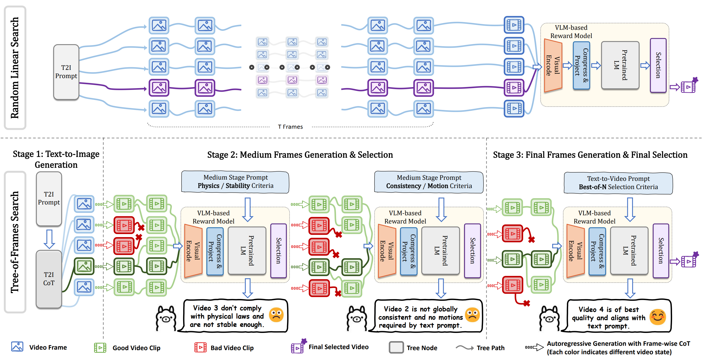

<div align="center">

# ✨Video-T1: Test-time Scaling for Video Generation✨

<p align="center">
    <a href="https://liuff19.github.io/">Fangfu Liu</a><sup>1*</sup>,
    <a href="https://hanyang-21.github.io/">Hanyang Wang</a><sup>1*</sup>,
    <a href="">Yimo Cai</a><sup>1</sup>,
    <a href="https://iseesaw.github.io/">Kaiyan Zhang</a><sup>1</sup>,
    <a href="https://xiaohangzhan.github.io/">Xiaohang Zhan</a><sup>2</sup>,
    <a href="https://duanyueqi.github.io/">Yueqi Duan</a><sup>1</sup>,
    <br>
    <sup>*</sup>Equal Contribution.
    <br>
    <sup>1</sup>Tsinghua University,
    <sup>2</sup>Tencent AI Lab,
</p>

<a href='https://arxiv.org/abs/'></a> &nbsp;&nbsp;&nbsp;&nbsp;
<a href='https://github.com/liuff19/Video-T1'></a> &nbsp;&nbsp;&nbsp;&nbsp;





This is the official repository of Video-T1, a **Test-Time Scaling** Framework for Video Generation.  

</div>

## News

- `2025.3.13` 🤗🤗🤗 We release *Video-T1: Test-time Scaling for Video Generation*

## Results


## Installation

### Dependencies:

```
git clone [REPO_URL]
cd VideoT1
conda create -n videot1 python==3.10
conda activate videot1
pip install -r requirements.txt
git clone https://github.com/LLaVA-VL/LLaVA-NeXT && cd LLaVA-NeXT && pip install --no-deps -e ".[train]"
```

### Model Checkpoints:
You need to download the following models:
 - **Pyramid-Flow** model checkpoint (for video generation)
 - **VisionReward-Video** model checkpoint (for video reward guidance)
 - **Image-CoT-Generation** model checkpoint (for ImageCoT)
 - (Optional) **DeepSeek-R1-Distill-Llama-8B (Or other LLMs)** model checkpoint (for hierarchical prompts)

## Inference

### 1. Quick start

```bash
cd VideoT1
# Modify videot1.py to assign checkpoints correctly.
python -m videot1.py --prompt "A corgi is playing drum kit." --video_name corgi
```

### 2.Inference Code

For inference, please refer to **videot1.py** for usage.

```python
# Import Pipeline and Base Model
from pyramid_flow.pyramid_dit import PyramidDiTForVideoGeneration
from pipeline.videot1_pipeline import VideoT1Generator

# Initialize Pyramid-Flow Model
pyramid_model = init_pyramid_model(model_path, device, model_variant)

# Initialize VisionReward Model
reward_model, tokenizer = init_vr_model(vr_path, device)

# Initialize VideoT1 Generator
generator = VideoT1Generator(
    pyramid_model,
    device,
    dtype=torch.bfloat16, 
    image_selector_path=imgcot_path,
    result_path=result_path,
    lm_path=lm_path,
)

# Courtesy of Pyramid-Flow
# Use the generator to generate videos using TTS strategy
best_video = generator.videot1_gen(
    prompt=prompt,
    num_inference_steps=[20, 20, 20],      # Inference steps for image branch at each level
    video_num_inference_steps=[20, 20, 20], # Inference steps for video branch at each level
    height=height,
    width=width,
    num_frames=temp,
    guidance_scale=7.0,           
    video_guidance_scale=5.0,      
    save_memory=True,             
    inference_multigpu=True,      
    video_branching_factors=video_branch,
    image_branching_factors=img_branch,
    reward_stages=reward_stages,
    hierarchical_prompts=True,     
    result_path=result_path,
    intermediate_path=intermed_path,
    video_name=video_name,
    **reward_params                
)

```

### 3.Multi-GPU Inference

Save GPU Memory by loading different models on different GPUs to avoid OOM problem. 

Example: Load **Reward Model** in GPU0, **Pyramid-Flow** in GPU1 and **Image-CoT** model in GPU2

```bash
# Load Models in different GPUs
python videot1_multigpu.py --prompt "A futuristic cityscape at sunset" --video_name cityscape_video --reward_device_id 0 --base_device_id 1 --imgcot_device_id 2
```

Please refer to videot1_multigpu.py for multi-GPU inference.

### 4.Usage Tips

1. **reward_stages**: Choose three indices for reward model pruning. If tree's depth is in three indices, all video clips would be fed into reward models for judging.

2. **variant**: We recommend 768p for better quality, choose from 384,768 (same as Pyramid-Flow)

3. **img_branch**: A list of integers, each correspond to the number of images at the beginning of ImageCoT process at this depth.

4. **video_branch**: A list of integers, each correspond to the number of generated next frames at this depth.  
*Namely, if img_branch is array* $A[]$, *video_branch is array* $B[]$, *then at depth* $i$, *we would have* $A[i] \times B[i]$ *initial images for each branch, and* $B[i]$ *next latent frames would be the children for each branch.*


## TODO

We would release Dataset for Test-Time Scaling in CogVideoX-5B

## Acknowledgement

We are thankful for the following great works when implementing Video-T1 and Yixin's great figure design:

[Pyramid-Flow](https://github.com/jy0205/Pyramid-Flow)  
[NOVA](https://github.com/baaivision/NOVA)  
[VisionReward](https://github.com/THUDM/VisionReward)  
[VideoLLaMA3](https://github.com/DAMO-NLP-SG/VideoLLaMA3)  
[CogVideoX](https://github.com/THUDM/CogVideo)  
[OpenSora](https://github.com/hpcaitech/Open-Sora)  


## Citation
```bibtex
@article{

}
```
